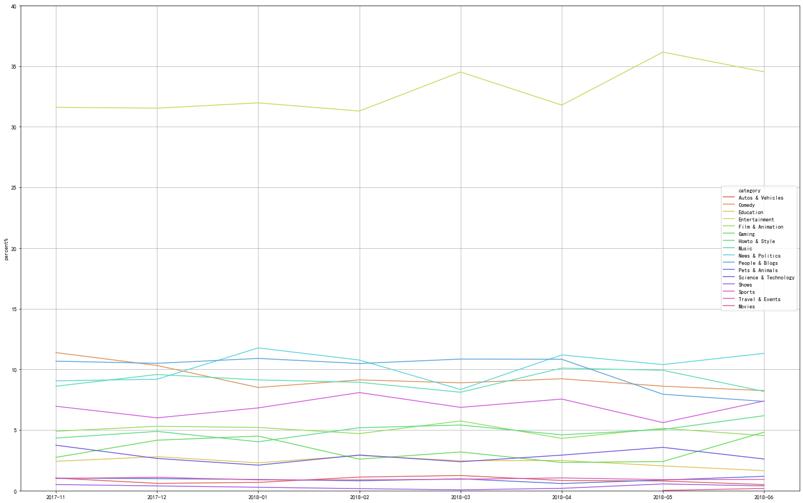
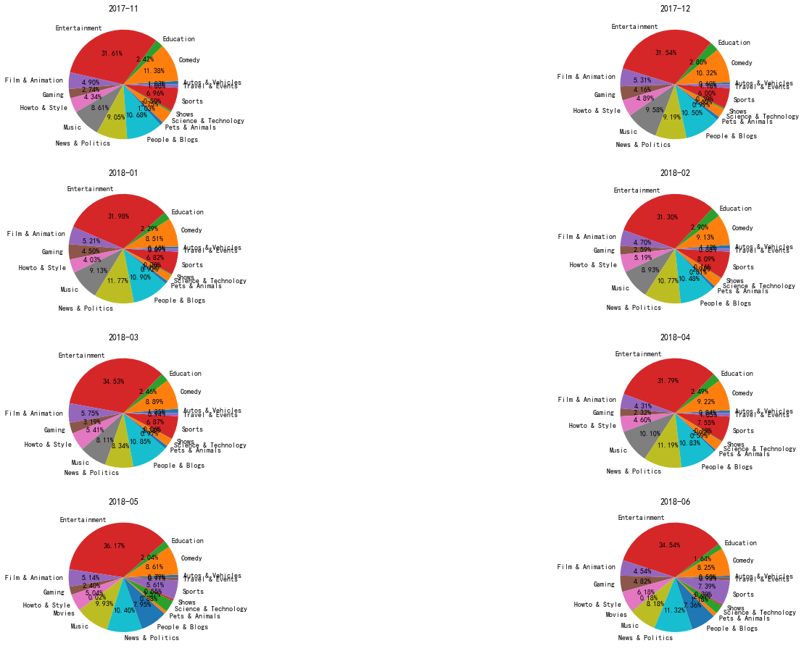
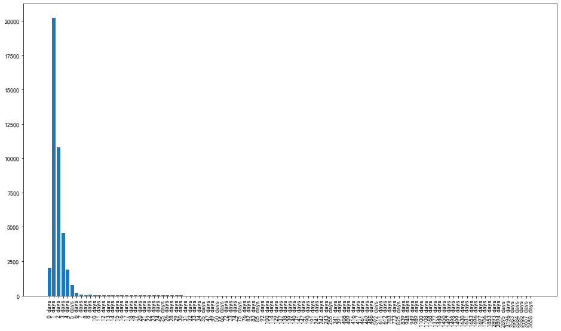
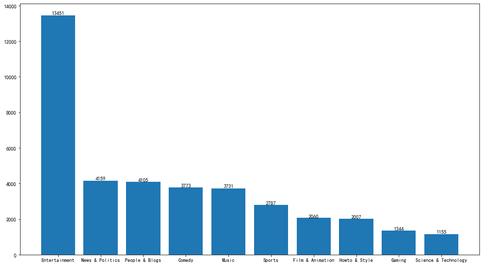
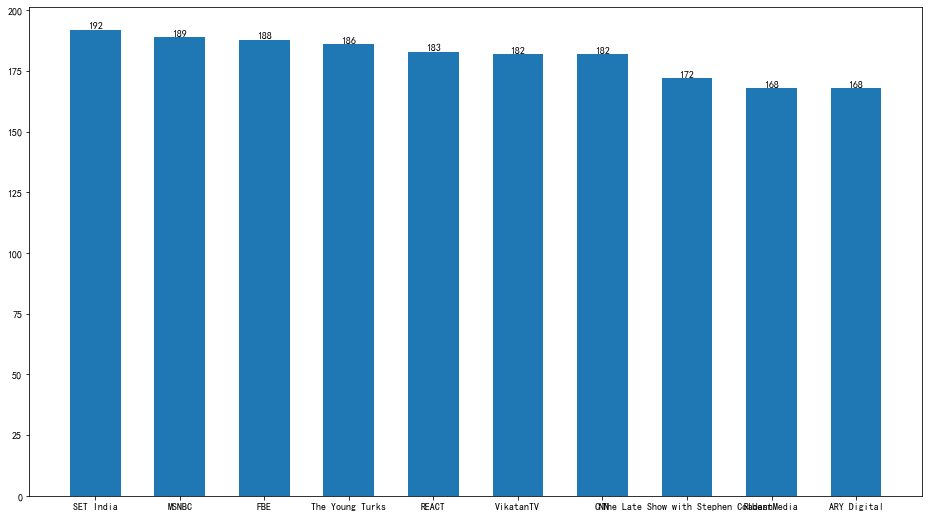
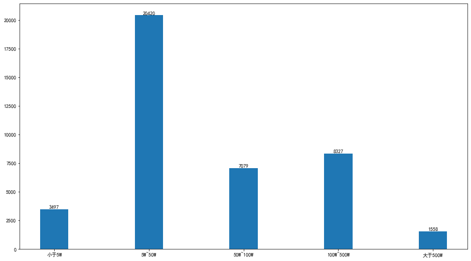
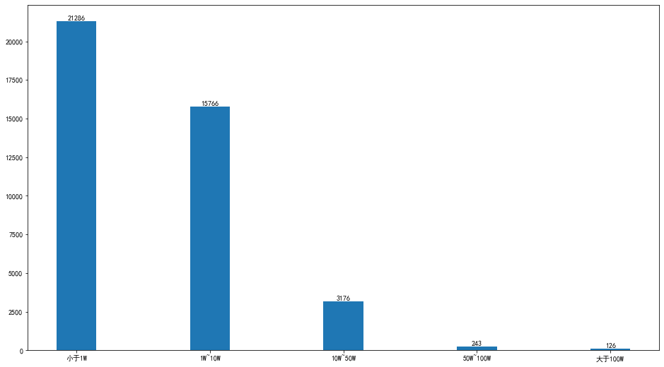
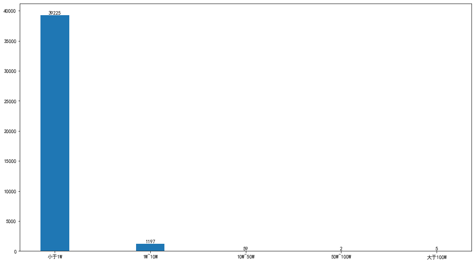
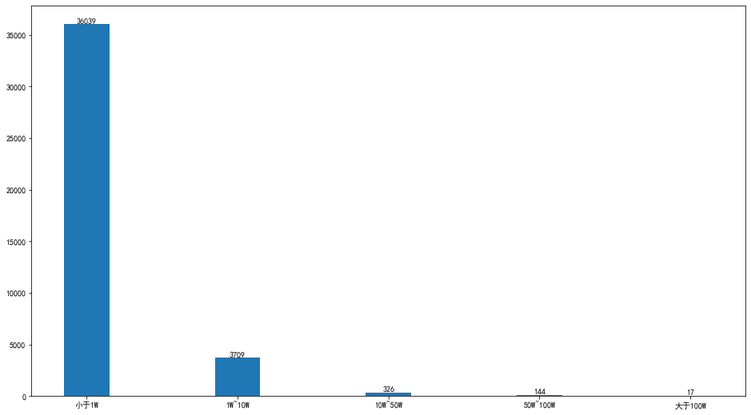
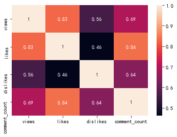

```python
import numpy as np
import pandas as pd
import matplotlib.pyplot as plt
import seaborn as sns
import json
%matplotlib inline
#读取CA数据

data_CA = pd.read_csv('D:/学习/kaggle/youtube视频分析/CAvideos.csv')
data_DE = pd.read_csv('D:/学习/kaggle/youtube视频分析/DEvideos.csv')
data_FR = pd.read_csv('D:/学习/kaggle/youtube视频分析/FRvideos.csv')
data_GB = pd.read_csv('D:/学习/kaggle/youtube视频分析/GBvideos.csv')
data_IN = pd.read_csv('D:/学习/kaggle/youtube视频分析/INvideos.csv')
data_JP = pd.read_csv('D:/学习/kaggle/youtube视频分析/JPvideos.csv')
data_JP = data_JP.loc[:,~data_JP.columns.str.contains('^Unnamed')]
data_KR = pd.read_csv('D:/学习/kaggle/youtube视频分析/KRvideos.csv')
data_KR = data_KR.loc[:,~data_KR.columns.str.contains('^Unnamed')]
data_MX = pd.read_csv('D:/学习/kaggle/youtube视频分析/MXvideos.csv')
data_RU = pd.read_csv('D:/学习/kaggle/youtube视频分析/RUvideos.csv')
data_RU = data_RU.loc[:,~data_RU.columns.str.contains('^Unnamed')]
data_US = pd.read_csv('D:/学习/kaggle/youtube视频分析/USvideos.csv')
data_US = data_US.loc[:,~data_US.columns.str.contains('^Unnamed')]
```

    C:\anzhuangdechengxu\anaconda\lib\site-packages\IPython\core\interactiveshell.py:3063: DtypeWarning: Columns (16,17,18,19,20,21,22,23,24,25,26,27,28,29,30) have mixed types.Specify dtype option on import or set low_memory=False.
      interactivity=interactivity, compiler=compiler, result=result)
    C:\anzhuangdechengxu\anaconda\lib\site-packages\IPython\core\interactiveshell.py:3063: DtypeWarning: Columns (18,25,26,27,28,29,30,31) have mixed types.Specify dtype option on import or set low_memory=False.
      interactivity=interactivity, compiler=compiler, result=result)


```python
#添加国家名称
data_CA['country'] = 'Canada'
data_DE['country'] = 'Germany'
data_FR['country'] = 'France'
data_GB['country'] = 'Great Britain'
data_IN['country'] = 'India'
data_JP['country'] = 'Japan'
data_KR['country'] = 'Korea'
data_MX['country'] = 'Mexico'
data_RU['country'] = 'Russia'
data_US['country'] = 'America'
```


```python
# 处理数据
# 合并数据集
data_full = pd.concat([data_CA,data_DE,data_FR,data_GB,data_IN,data_JP,data_KR,
                     data_MX,data_RU,data_US],axis=0)
data_full.columns
```


    Index(['video_id', 'trending_date', 'title', 'channel_title', 'category_id',
           'publish_time', 'tags', 'views', 'likes', 'dislikes', 'comment_count',
           'thumbnail_link', 'comments_disabled', 'ratings_disabled',
           'video_error_or_removed', 'description', 'country'],
          dtype='object')


```python
data_full
```


<div>
<style scoped>
    .dataframe tbody tr th:only-of-type {
        vertical-align: middle;
    }

    .dataframe tbody tr th {
        vertical-align: top;
    }
    
    .dataframe thead th {
        text-align: right;
    }
</style>
<table border="1" class="dataframe">
  <thead>
    <tr style="text-align: right;">
      <th></th>
      <th>video_id</th>
      <th>trending_date</th>
      <th>title</th>
      <th>channel_title</th>
      <th>category_id</th>
      <th>publish_time</th>
      <th>tags</th>
      <th>views</th>
      <th>likes</th>
      <th>dislikes</th>
      <th>comment_count</th>
      <th>thumbnail_link</th>
      <th>comments_disabled</th>
      <th>ratings_disabled</th>
      <th>video_error_or_removed</th>
      <th>description</th>
      <th>country</th>
    </tr>
  </thead>
  <tbody>
    <tr>
      <th>0</th>
      <td>n1WpP7iowLc</td>
      <td>17.14.11</td>
      <td>Eminem - Walk On Water (Audio) ft. Beyoncé</td>
      <td>EminemVEVO</td>
      <td>10</td>
      <td>2017-11-10T17:00:03.000Z</td>
      <td>Eminem|"Walk"|"On"|"Water"|"Aftermath/Shady/In...</td>
      <td>17158579</td>
      <td>787425</td>
      <td>43420</td>
      <td>125882</td>
      <td>https://i.ytimg.com/vi/n1WpP7iowLc/default.jpg</td>
      <td>False</td>
      <td>False</td>
      <td>False</td>
      <td>Eminem's new track Walk on Water ft. Beyoncé i...</td>
      <td>Canada</td>
    </tr>
    <tr>
      <th>1</th>
      <td>0dBIkQ4Mz1M</td>
      <td>17.14.11</td>
      <td>PLUSH - Bad Unboxing Fan Mail</td>
      <td>iDubbbzTV</td>
      <td>23</td>
      <td>2017-11-13T17:00:00.000Z</td>
      <td>plush|"bad unboxing"|"unboxing"|"fan mail"|"id...</td>
      <td>1014651</td>
      <td>127794</td>
      <td>1688</td>
      <td>13030</td>
      <td>https://i.ytimg.com/vi/0dBIkQ4Mz1M/default.jpg</td>
      <td>False</td>
      <td>False</td>
      <td>False</td>
      <td>STill got a lot of packages. Probably will las...</td>
      <td>Canada</td>
    </tr>
    <tr>
      <th>2</th>
      <td>5qpjK5DgCt4</td>
      <td>17.14.11</td>
      <td>Racist Superman | Rudy Mancuso, King Bach &amp; Le...</td>
      <td>Rudy Mancuso</td>
      <td>23</td>
      <td>2017-11-12T19:05:24.000Z</td>
      <td>racist superman|"rudy"|"mancuso"|"king"|"bach"...</td>
      <td>3191434</td>
      <td>146035</td>
      <td>5339</td>
      <td>8181</td>
      <td>https://i.ytimg.com/vi/5qpjK5DgCt4/default.jpg</td>
      <td>False</td>
      <td>False</td>
      <td>False</td>
      <td>WATCH MY PREVIOUS VIDEO ▶ \n\nSUBSCRIBE ► http...</td>
      <td>Canada</td>
    </tr>
    <tr>
      <th>3</th>
      <td>d380meD0W0M</td>
      <td>17.14.11</td>
      <td>I Dare You: GOING BALD!?</td>
      <td>nigahiga</td>
      <td>24</td>
      <td>2017-11-12T18:01:41.000Z</td>
      <td>ryan|"higa"|"higatv"|"nigahiga"|"i dare you"|"...</td>
      <td>2095828</td>
      <td>132239</td>
      <td>1989</td>
      <td>17518</td>
      <td>https://i.ytimg.com/vi/d380meD0W0M/default.jpg</td>
      <td>False</td>
      <td>False</td>
      <td>False</td>
      <td>I know it's been a while since we did this sho...</td>
      <td>Canada</td>
    </tr>
    <tr>
      <th>4</th>
      <td>2Vv-BfVoq4g</td>
      <td>17.14.11</td>
      <td>Ed Sheeran - Perfect (Official Music Video)</td>
      <td>Ed Sheeran</td>
      <td>10</td>
      <td>2017-11-09T11:04:14.000Z</td>
      <td>edsheeran|"ed sheeran"|"acoustic"|"live"|"cove...</td>
      <td>33523622</td>
      <td>1634130</td>
      <td>21082</td>
      <td>85067</td>
      <td>https://i.ytimg.com/vi/2Vv-BfVoq4g/default.jpg</td>
      <td>False</td>
      <td>False</td>
      <td>False</td>
      <td>🎧: https://ad.gt/yt-perfect\n💰: https://atlant...</td>
      <td>Canada</td>
    </tr>
    <tr>
      <th>...</th>
      <td>...</td>
      <td>...</td>
      <td>...</td>
      <td>...</td>
      <td>...</td>
      <td>...</td>
      <td>...</td>
      <td>...</td>
      <td>...</td>
      <td>...</td>
      <td>...</td>
      <td>...</td>
      <td>...</td>
      <td>...</td>
      <td>...</td>
      <td>...</td>
      <td>...</td>
    </tr>
    <tr>
      <th>40944</th>
      <td>BZt0qjTWNhw</td>
      <td>18.14.06</td>
      <td>The Cat Who Caught the Laser</td>
      <td>AaronsAnimals</td>
      <td>15</td>
      <td>2018-05-18T13:00:04.000Z</td>
      <td>aarons animals|"aarons"|"animals"|"cat"|"cats"...</td>
      <td>1685609</td>
      <td>38160</td>
      <td>1385</td>
      <td>2657</td>
      <td>https://i.ytimg.com/vi/BZt0qjTWNhw/default.jpg</td>
      <td>False</td>
      <td>False</td>
      <td>False</td>
      <td>The Cat Who Caught the Laser - Aaron's Animals</td>
      <td>America</td>
    </tr>
    <tr>
      <th>40945</th>
      <td>1h7KV2sjUWY</td>
      <td>18.14.06</td>
      <td>True Facts : Ant Mutualism</td>
      <td>zefrank1</td>
      <td>22</td>
      <td>2018-05-18T01:00:06.000Z</td>
      <td>[none]</td>
      <td>1064798</td>
      <td>60008</td>
      <td>382</td>
      <td>3936</td>
      <td>https://i.ytimg.com/vi/1h7KV2sjUWY/default.jpg</td>
      <td>False</td>
      <td>False</td>
      <td>False</td>
      <td>NaN</td>
      <td>America</td>
    </tr>
    <tr>
      <th>40946</th>
      <td>D6Oy4LfoqsU</td>
      <td>18.14.06</td>
      <td>I GAVE SAFIYA NYGAARD A PERFECT HAIR MAKEOVER ...</td>
      <td>Brad Mondo</td>
      <td>24</td>
      <td>2018-05-18T17:34:22.000Z</td>
      <td>I gave safiya nygaard a perfect hair makeover ...</td>
      <td>1066451</td>
      <td>48068</td>
      <td>1032</td>
      <td>3992</td>
      <td>https://i.ytimg.com/vi/D6Oy4LfoqsU/default.jpg</td>
      <td>False</td>
      <td>False</td>
      <td>False</td>
      <td>I had so much fun transforming Safiyas hair in...</td>
      <td>America</td>
    </tr>
    <tr>
      <th>40947</th>
      <td>oV0zkMe1K8s</td>
      <td>18.14.06</td>
      <td>How Black Panther Should Have Ended</td>
      <td>How It Should Have Ended</td>
      <td>1</td>
      <td>2018-05-17T17:00:04.000Z</td>
      <td>Black Panther|"HISHE"|"Marvel"|"Infinity War"|...</td>
      <td>5660813</td>
      <td>192957</td>
      <td>2846</td>
      <td>13088</td>
      <td>https://i.ytimg.com/vi/oV0zkMe1K8s/default.jpg</td>
      <td>False</td>
      <td>False</td>
      <td>False</td>
      <td>How Black Panther Should Have EndedWatch More ...</td>
      <td>America</td>
    </tr>
    <tr>
      <th>40948</th>
      <td>ooyjaVdt-jA</td>
      <td>18.14.06</td>
      <td>Official Call of Duty®: Black Ops 4 — Multipla...</td>
      <td>Call of Duty</td>
      <td>20</td>
      <td>2018-05-17T17:09:38.000Z</td>
      <td>call of duty|"cod"|"activision"|"Black Ops 4"</td>
      <td>10306119</td>
      <td>357079</td>
      <td>212976</td>
      <td>144795</td>
      <td>https://i.ytimg.com/vi/ooyjaVdt-jA/default.jpg</td>
      <td>False</td>
      <td>False</td>
      <td>False</td>
      <td>Call of Duty: Black Ops 4 Multiplayer raises t...</td>
      <td>America</td>
    </tr>
  </tbody>
</table>
<p>375860 rows × 17 columns</p>
</div>


```python
pd.set_option('display.float_format',lambda x:'%.3f'%x)
```


```python
data_full.info(verbose = True)
```

    <class 'pandas.core.frame.DataFrame'>
    Int64Index: 375860 entries, 0 to 40948
    Data columns (total 17 columns):
     #   Column                  Non-Null Count   Dtype 
    ---  ------                  --------------   ----- 
     0   video_id                375860 non-null  object
     1   trending_date           375860 non-null  object
     2   title                   375860 non-null  object
     3   channel_title           375860 non-null  object
     4   category_id             375860 non-null  int64 
     5   publish_time            375860 non-null  object
     6   tags                    375860 non-null  object
     7   views                   375860 non-null  object
     8   likes                   375858 non-null  object
     9   dislikes                375858 non-null  object
     10  comment_count           375858 non-null  object
     11  thumbnail_link          375858 non-null  object
     12  comments_disabled       375858 non-null  object
     13  ratings_disabled        375858 non-null  object
     14  video_error_or_removed  375858 non-null  object
     15  description             356384 non-null  object
     16  country                 375860 non-null  object
    dtypes: int64(1), object(16)
    memory usage: 51.6+ MB


```python
data_publish_time = pd.DataFrame(data_full['publish_time'].str.split('T',expand=True,n=1))

data_full = pd.concat([data_full,data_publish_time],axis=1)
```


```python
#分割publishi_data列并修改列名称
data_full.reset_index(drop=True,inplace=True)
data_full.rename(columns={0:'publish_date'},inplace=True)
data_full
```


<div>
<style scoped>
    .dataframe tbody tr th:only-of-type {
        vertical-align: middle;
    }

    .dataframe tbody tr th {
        vertical-align: top;
    }
    
    .dataframe thead th {
        text-align: right;
    }
</style>
<table border="1" class="dataframe">
  <thead>
    <tr style="text-align: right;">
      <th></th>
      <th>video_id</th>
      <th>trending_date</th>
      <th>title</th>
      <th>channel_title</th>
      <th>category_id</th>
      <th>publish_time</th>
      <th>tags</th>
      <th>views</th>
      <th>likes</th>
      <th>dislikes</th>
      <th>comment_count</th>
      <th>thumbnail_link</th>
      <th>comments_disabled</th>
      <th>ratings_disabled</th>
      <th>video_error_or_removed</th>
      <th>description</th>
      <th>country</th>
      <th>publish_date</th>
      <th>1</th>
    </tr>
  </thead>
  <tbody>
    <tr>
      <th>0</th>
      <td>n1WpP7iowLc</td>
      <td>17.14.11</td>
      <td>Eminem - Walk On Water (Audio) ft. Beyoncé</td>
      <td>EminemVEVO</td>
      <td>10</td>
      <td>2017-11-10T17:00:03.000Z</td>
      <td>Eminem|"Walk"|"On"|"Water"|"Aftermath/Shady/In...</td>
      <td>17158579</td>
      <td>787425</td>
      <td>43420</td>
      <td>125882</td>
      <td>https://i.ytimg.com/vi/n1WpP7iowLc/default.jpg</td>
      <td>False</td>
      <td>False</td>
      <td>False</td>
      <td>Eminem's new track Walk on Water ft. Beyoncé i...</td>
      <td>Canada</td>
      <td>2017-11-10</td>
      <td>17:00:03.000Z</td>
    </tr>
    <tr>
      <th>1</th>
      <td>0dBIkQ4Mz1M</td>
      <td>17.14.11</td>
      <td>PLUSH - Bad Unboxing Fan Mail</td>
      <td>iDubbbzTV</td>
      <td>23</td>
      <td>2017-11-13T17:00:00.000Z</td>
      <td>plush|"bad unboxing"|"unboxing"|"fan mail"|"id...</td>
      <td>1014651</td>
      <td>127794</td>
      <td>1688</td>
      <td>13030</td>
      <td>https://i.ytimg.com/vi/0dBIkQ4Mz1M/default.jpg</td>
      <td>False</td>
      <td>False</td>
      <td>False</td>
      <td>STill got a lot of packages. Probably will las...</td>
      <td>Canada</td>
      <td>2017-11-13</td>
      <td>17:00:00.000Z</td>
    </tr>
    <tr>
      <th>2</th>
      <td>5qpjK5DgCt4</td>
      <td>17.14.11</td>
      <td>Racist Superman | Rudy Mancuso, King Bach &amp; Le...</td>
      <td>Rudy Mancuso</td>
      <td>23</td>
      <td>2017-11-12T19:05:24.000Z</td>
      <td>racist superman|"rudy"|"mancuso"|"king"|"bach"...</td>
      <td>3191434</td>
      <td>146035</td>
      <td>5339</td>
      <td>8181</td>
      <td>https://i.ytimg.com/vi/5qpjK5DgCt4/default.jpg</td>
      <td>False</td>
      <td>False</td>
      <td>False</td>
      <td>WATCH MY PREVIOUS VIDEO ▶ \n\nSUBSCRIBE ► http...</td>
      <td>Canada</td>
      <td>2017-11-12</td>
      <td>19:05:24.000Z</td>
    </tr>
    <tr>
      <th>3</th>
      <td>d380meD0W0M</td>
      <td>17.14.11</td>
      <td>I Dare You: GOING BALD!?</td>
      <td>nigahiga</td>
      <td>24</td>
      <td>2017-11-12T18:01:41.000Z</td>
      <td>ryan|"higa"|"higatv"|"nigahiga"|"i dare you"|"...</td>
      <td>2095828</td>
      <td>132239</td>
      <td>1989</td>
      <td>17518</td>
      <td>https://i.ytimg.com/vi/d380meD0W0M/default.jpg</td>
      <td>False</td>
      <td>False</td>
      <td>False</td>
      <td>I know it's been a while since we did this sho...</td>
      <td>Canada</td>
      <td>2017-11-12</td>
      <td>18:01:41.000Z</td>
    </tr>
    <tr>
      <th>4</th>
      <td>2Vv-BfVoq4g</td>
      <td>17.14.11</td>
      <td>Ed Sheeran - Perfect (Official Music Video)</td>
      <td>Ed Sheeran</td>
      <td>10</td>
      <td>2017-11-09T11:04:14.000Z</td>
      <td>edsheeran|"ed sheeran"|"acoustic"|"live"|"cove...</td>
      <td>33523622</td>
      <td>1634130</td>
      <td>21082</td>
      <td>85067</td>
      <td>https://i.ytimg.com/vi/2Vv-BfVoq4g/default.jpg</td>
      <td>False</td>
      <td>False</td>
      <td>False</td>
      <td>🎧: https://ad.gt/yt-perfect\n💰: https://atlant...</td>
      <td>Canada</td>
      <td>2017-11-09</td>
      <td>11:04:14.000Z</td>
    </tr>
    <tr>
      <th>...</th>
      <td>...</td>
      <td>...</td>
      <td>...</td>
      <td>...</td>
      <td>...</td>
      <td>...</td>
      <td>...</td>
      <td>...</td>
      <td>...</td>
      <td>...</td>
      <td>...</td>
      <td>...</td>
      <td>...</td>
      <td>...</td>
      <td>...</td>
      <td>...</td>
      <td>...</td>
      <td>...</td>
      <td>...</td>
    </tr>
    <tr>
      <th>375855</th>
      <td>BZt0qjTWNhw</td>
      <td>18.14.06</td>
      <td>The Cat Who Caught the Laser</td>
      <td>AaronsAnimals</td>
      <td>15</td>
      <td>2018-05-18T13:00:04.000Z</td>
      <td>aarons animals|"aarons"|"animals"|"cat"|"cats"...</td>
      <td>1685609</td>
      <td>38160</td>
      <td>1385</td>
      <td>2657</td>
      <td>https://i.ytimg.com/vi/BZt0qjTWNhw/default.jpg</td>
      <td>False</td>
      <td>False</td>
      <td>False</td>
      <td>The Cat Who Caught the Laser - Aaron's Animals</td>
      <td>America</td>
      <td>2018-05-18</td>
      <td>13:00:04.000Z</td>
    </tr>
    <tr>
      <th>375856</th>
      <td>1h7KV2sjUWY</td>
      <td>18.14.06</td>
      <td>True Facts : Ant Mutualism</td>
      <td>zefrank1</td>
      <td>22</td>
      <td>2018-05-18T01:00:06.000Z</td>
      <td>[none]</td>
      <td>1064798</td>
      <td>60008</td>
      <td>382</td>
      <td>3936</td>
      <td>https://i.ytimg.com/vi/1h7KV2sjUWY/default.jpg</td>
      <td>False</td>
      <td>False</td>
      <td>False</td>
      <td>NaN</td>
      <td>America</td>
      <td>2018-05-18</td>
      <td>01:00:06.000Z</td>
    </tr>
    <tr>
      <th>375857</th>
      <td>D6Oy4LfoqsU</td>
      <td>18.14.06</td>
      <td>I GAVE SAFIYA NYGAARD A PERFECT HAIR MAKEOVER ...</td>
      <td>Brad Mondo</td>
      <td>24</td>
      <td>2018-05-18T17:34:22.000Z</td>
      <td>I gave safiya nygaard a perfect hair makeover ...</td>
      <td>1066451</td>
      <td>48068</td>
      <td>1032</td>
      <td>3992</td>
      <td>https://i.ytimg.com/vi/D6Oy4LfoqsU/default.jpg</td>
      <td>False</td>
      <td>False</td>
      <td>False</td>
      <td>I had so much fun transforming Safiyas hair in...</td>
      <td>America</td>
      <td>2018-05-18</td>
      <td>17:34:22.000Z</td>
    </tr>
    <tr>
      <th>375858</th>
      <td>oV0zkMe1K8s</td>
      <td>18.14.06</td>
      <td>How Black Panther Should Have Ended</td>
      <td>How It Should Have Ended</td>
      <td>1</td>
      <td>2018-05-17T17:00:04.000Z</td>
      <td>Black Panther|"HISHE"|"Marvel"|"Infinity War"|...</td>
      <td>5660813</td>
      <td>192957</td>
      <td>2846</td>
      <td>13088</td>
      <td>https://i.ytimg.com/vi/oV0zkMe1K8s/default.jpg</td>
      <td>False</td>
      <td>False</td>
      <td>False</td>
      <td>How Black Panther Should Have EndedWatch More ...</td>
      <td>America</td>
      <td>2018-05-17</td>
      <td>17:00:04.000Z</td>
    </tr>
    <tr>
      <th>375859</th>
      <td>ooyjaVdt-jA</td>
      <td>18.14.06</td>
      <td>Official Call of Duty®: Black Ops 4 — Multipla...</td>
      <td>Call of Duty</td>
      <td>20</td>
      <td>2018-05-17T17:09:38.000Z</td>
      <td>call of duty|"cod"|"activision"|"Black Ops 4"</td>
      <td>10306119</td>
      <td>357079</td>
      <td>212976</td>
      <td>144795</td>
      <td>https://i.ytimg.com/vi/ooyjaVdt-jA/default.jpg</td>
      <td>False</td>
      <td>False</td>
      <td>False</td>
      <td>Call of Duty: Black Ops 4 Multiplayer raises t...</td>
      <td>America</td>
      <td>2018-05-17</td>
      <td>17:09:38.000Z</td>
    </tr>
  </tbody>
</table>
<p>375860 rows × 19 columns</p>
</div>


```python
data_full.isnull().sum()
```


    video_id                      0
    trending_date                 0
    title                         0
    channel_title                 0
    category_id                   0
    publish_time                  0
    tags                          0
    views                         0
    likes                         2
    dislikes                      2
    comment_count                 2
    thumbnail_link                2
    comments_disabled             2
    ratings_disabled              2
    video_error_or_removed        2
    description               19476
    country                       0
    publish_date                  0
    1                             0
    dtype: int64


```python
# like~description 缺失的数据展示
miss_data = data_full[data_full['likes'].isnull()]
miss_data
```


<div>
<style scoped>
    .dataframe tbody tr th:only-of-type {
        vertical-align: middle;
    }

    .dataframe tbody tr th {
        vertical-align: top;
    }
    
    .dataframe thead th {
        text-align: right;
    }
</style>
<table border="1" class="dataframe">
  <thead>
    <tr style="text-align: right;">
      <th></th>
      <th>video_id</th>
      <th>trending_date</th>
      <th>title</th>
      <th>channel_title</th>
      <th>category_id</th>
      <th>publish_time</th>
      <th>tags</th>
      <th>views</th>
      <th>likes</th>
      <th>dislikes</th>
      <th>comment_count</th>
      <th>thumbnail_link</th>
      <th>comments_disabled</th>
      <th>ratings_disabled</th>
      <th>video_error_or_removed</th>
      <th>description</th>
      <th>country</th>
      <th>publish_date</th>
      <th>1</th>
    </tr>
  </thead>
  <tbody>
    <tr>
      <th>320120</th>
      <td>TuGxk4FHx2M</td>
      <td>18.25.03</td>
      <td>Когда уже закончится коррекция Биткоина? часть 2</td>
      <td>Igor Jumatov</td>
      <td>22</td>
      <td>2018-03-24T21:47:02.000Z</td>
      <td>+100500|"Сообщество Онлайн Инвесторов iTuber"|...</td>
      <td>что не боитесь потерять!\n\nМой Твиттер: http...</td>
      <td>NaN</td>
      <td>NaN</td>
      <td>NaN</td>
      <td>NaN</td>
      <td>NaN</td>
      <td>NaN</td>
      <td>NaN</td>
      <td>NaN</td>
      <td>Russia</td>
      <td>2018-03-24</td>
      <td>21:47:02.000Z</td>
    </tr>
    <tr>
      <th>321672</th>
      <td>BKTquNGMKHc</td>
      <td>18.02.04</td>
      <td>Кто дампит Биткоин? Хомяков опять побреют!</td>
      <td>Igor Jumatov</td>
      <td>22</td>
      <td>2018-04-01T22:03:14.000Z</td>
      <td>+100500|"TSI Analytics"|"Сообщество Онлайн Инв...</td>
      <td>что не боитесь потерять!\n\nМой Твиттер: http...</td>
      <td>NaN</td>
      <td>NaN</td>
      <td>NaN</td>
      <td>NaN</td>
      <td>NaN</td>
      <td>NaN</td>
      <td>NaN</td>
      <td>NaN</td>
      <td>Russia</td>
      <td>2018-04-01</td>
      <td>22:03:14.000Z</td>
    </tr>
  </tbody>
</table>
</div>


```python
#删除冗余列
data_full.drop(['publish_time',1],axis=1,inplace=True)
data_full.columns
```


    Index(['video_id', 'trending_date', 'title', 'channel_title', 'category_id',
           'tags', 'views', 'likes', 'dislikes', 'comment_count', 'thumbnail_link',
           'comments_disabled', 'ratings_disabled', 'video_error_or_removed',
           'description', 'country', 'publish_date'],
          dtype='object')


```python
#删除冗余行
data_full.drop(index=[320120,321672],axis=0,inplace=True)
```


```python
data_full.isnull().sum()
```


    video_id                      0
    trending_date                 0
    title                         0
    channel_title                 0
    category_id                   0
    tags                          0
    views                         0
    likes                         0
    dislikes                      0
    comment_count                 0
    thumbnail_link                0
    comments_disabled             0
    ratings_disabled              0
    video_error_or_removed        0
    description               19474
    country                       0
    publish_date                  0
    dtype: int64


```python
data_full.info()
```

    <class 'pandas.core.frame.DataFrame'>
    Int64Index: 375858 entries, 0 to 375859
    Data columns (total 17 columns):
     #   Column                  Non-Null Count   Dtype 
    ---  ------                  --------------   ----- 
     0   video_id                375858 non-null  object
     1   trending_date           375858 non-null  object
     2   title                   375858 non-null  object
     3   channel_title           375858 non-null  object
     4   category_id             375858 non-null  int64 
     5   tags                    375858 non-null  object
     6   views                   375858 non-null  object
     7   likes                   375858 non-null  object
     8   dislikes                375858 non-null  object
     9   comment_count           375858 non-null  object
     10  thumbnail_link          375858 non-null  object
     11  comments_disabled       375858 non-null  object
     12  ratings_disabled        375858 non-null  object
     13  video_error_or_removed  375858 non-null  object
     14  description             356384 non-null  object
     15  country                 375858 non-null  object
     16  publish_date            375858 non-null  object
    dtypes: int64(1), object(16)
    memory usage: 51.6+ MB


```python
data_full['publish_date'] = pd.to_datetime(data_full['publish_date'])
data_full['trending_date'] = pd.to_datetime(data_full['trending_date'],format='%y.%d.%m')
data_full['video_id'].nunique()

```


    184213


```python
data_full['category_id'].nunique()
```


    18


```python
data_full[data_full['views'].isin([' а также сборы трав и питания необходимо'])]
data_full[data_full['views'].isin([' при этом'])]
data_full[data_full['views'].isin([' то значит'])]
```


<div>
<style scoped>
    .dataframe tbody tr th:only-of-type {
        vertical-align: middle;
    }

    .dataframe tbody tr th {
        vertical-align: top;
    }
    
    .dataframe thead th {
        text-align: right;
    }
</style>
<table border="1" class="dataframe">
  <thead>
    <tr style="text-align: right;">
      <th></th>
      <th>video_id</th>
      <th>trending_date</th>
      <th>title</th>
      <th>channel_title</th>
      <th>category_id</th>
      <th>tags</th>
      <th>views</th>
      <th>likes</th>
      <th>dislikes</th>
      <th>comment_count</th>
      <th>thumbnail_link</th>
      <th>comments_disabled</th>
      <th>ratings_disabled</th>
      <th>video_error_or_removed</th>
      <th>description</th>
      <th>country</th>
      <th>publish_date</th>
    </tr>
  </thead>
  <tbody>
    <tr>
      <th>328509</th>
      <td>nbepRqrAWEQ</td>
      <td>2018-05-12</td>
      <td>ЛУЧОК: садим НОВЫМ СПОСОБОМ!</td>
      <td>А ты знал?</td>
      <td>22</td>
      <td>+когда сажать лук|"А ТЫ ЗНАЛ?"|"лук севка"|"лу...</td>
      <td>то значит</td>
      <td>наступило самое подходящее время  высаживать ...</td>
      <td>как всегда</td>
      <td>ориентируемся по погоде  и если весна ранняя...</td>
      <td>то у нас</td>
      <td>в среднем Повожье</td>
      <td>посадку можно производить  даже в конце апреля</td>
      <td>а если как в этом году</td>
      <td>запоздалая</td>
      <td>Russia</td>
      <td>2018-05-11</td>
    </tr>
  </tbody>
</table>
</div>


```python
data_full.drop(index=[320522],inplace=True)
```


```python
data_full.drop(index=[328509],inplace=True)
```


```python
data_full.drop(index=[295963],inplace=True)
```


```python
data_full['views'].astype(int)

```


    0         17158579
    1          1014651
    2          3191434
    3          2095828
    4         33523622
                ...   
    375855     1685609
    375856     1064798
    375857     1066451
    375858     5660813
    375859    10306119
    Name: views, Length: 375855, dtype: int32


```python
data_full['likes'] = data_full['likes'].astype(int)
```


```python
data_full['dislikes'] = data_full['dislikes'].astype('int')
```


```python
data_full['comment_count'] = data_full['comment_count'].astype('int')
```


```python
data_full.info()
```

    <class 'pandas.core.frame.DataFrame'>
    Int64Index: 375855 entries, 0 to 375859
    Data columns (total 17 columns):
     #   Column                  Non-Null Count   Dtype         
    ---  ------                  --------------   -----         
     0   video_id                375855 non-null  object        
     1   trending_date           375855 non-null  datetime64[ns]
     2   title                   375855 non-null  object        
     3   channel_title           375855 non-null  object        
     4   category_id             375855 non-null  int64         
     5   tags                    375855 non-null  object        
     6   views                   375855 non-null  object        
     7   likes                   375855 non-null  int32         
     8   dislikes                375855 non-null  int32         
     9   comment_count           375855 non-null  int32         
     10  thumbnail_link          375855 non-null  object        
     11  comments_disabled       375855 non-null  object        
     12  ratings_disabled        375855 non-null  object        
     13  video_error_or_removed  375855 non-null  object        
     14  description             356382 non-null  object        
     15  country                 375855 non-null  object        
     16  publish_date            375855 non-null  datetime64[ns]
    dtypes: datetime64[ns](2), int32(3), int64(1), object(11)
    memory usage: 47.3+ MB


```python
data_full.describe()
```


<div>
<style scoped>
    .dataframe tbody tr th:only-of-type {
        vertical-align: middle;
    }

    .dataframe tbody tr th {
        vertical-align: top;
    }
    
    .dataframe thead th {
        text-align: right;
    }
</style>
<table border="1" class="dataframe">
  <thead>
    <tr style="text-align: right;">
      <th></th>
      <th>category_id</th>
      <th>likes</th>
      <th>dislikes</th>
      <th>comment_count</th>
    </tr>
  </thead>
  <tbody>
    <tr>
      <th>count</th>
      <td>375855.000</td>
      <td>375855.000</td>
      <td>375855.000</td>
      <td>375855.000</td>
    </tr>
    <tr>
      <th>mean</th>
      <td>20.232</td>
      <td>37891.112</td>
      <td>2126.502</td>
      <td>4254.431</td>
    </tr>
    <tr>
      <th>std</th>
      <td>7.132</td>
      <td>165431.155</td>
      <td>22486.948</td>
      <td>25461.601</td>
    </tr>
    <tr>
      <th>min</th>
      <td>1.000</td>
      <td>0.000</td>
      <td>0.000</td>
      <td>0.000</td>
    </tr>
    <tr>
      <th>25%</th>
      <td>17.000</td>
      <td>669.000</td>
      <td>41.000</td>
      <td>109.000</td>
    </tr>
    <tr>
      <th>50%</th>
      <td>23.000</td>
      <td>3447.000</td>
      <td>179.000</td>
      <td>512.000</td>
    </tr>
    <tr>
      <th>75%</th>
      <td>24.000</td>
      <td>17482.000</td>
      <td>749.000</td>
      <td>2011.000</td>
    </tr>
    <tr>
      <th>max</th>
      <td>44.000</td>
      <td>5613827.000</td>
      <td>1944971.000</td>
      <td>1626501.000</td>
    </tr>
  </tbody>
</table>
</div>


```python
#裁剪年-月
data_full['trending_date_year_month'] = data_full['trending_date'].dt.to_period('M')
```


```python
data_full.info()
```

    <class 'pandas.core.frame.DataFrame'>
    Int64Index: 375855 entries, 0 to 375859
    Data columns (total 18 columns):
     #   Column                    Non-Null Count   Dtype         
    ---  ------                    --------------   -----         
     0   video_id                  375855 non-null  object        
     1   trending_date             375855 non-null  datetime64[ns]
     2   title                     375855 non-null  object        
     3   channel_title             375855 non-null  object        
     4   category_id               375855 non-null  int64         
     5   tags                      375855 non-null  object        
     6   views                     375855 non-null  object        
     7   likes                     375855 non-null  int32         
     8   dislikes                  375855 non-null  int32         
     9   comment_count             375855 non-null  int32         
     10  thumbnail_link            375855 non-null  object        
     11  comments_disabled         375855 non-null  object        
     12  ratings_disabled          375855 non-null  object        
     13  video_error_or_removed    375855 non-null  object        
     14  description               356382 non-null  object        
     15  country                   375855 non-null  object        
     16  publish_date              375855 non-null  datetime64[ns]
     17  trending_date_year_month  375855 non-null  period[M]     
    dtypes: datetime64[ns](2), int32(3), int64(1), object(11), period[M](1)
    memory usage: 50.2+ MB


```python
data_json = pd.read_json('D://学习/kaggle/youtube视频分析/CA_category_id.json')
data_json_cag = data_json['items']
print(data_json_cag[0])
category_data = data_json_cag[0]['snippet']['title']

category_id = []
category_id_num = []
snippet = []
for i in data_json_cag:
    category_id.append(i['id'])
    snippet.append(i['snippet'])
title=[]   
data_json_cag['snippet'] = np.array(snippet)
for j in data_json_cag['snippet']:
    title.append(j['title'])
print(category_id)
print(title)
```

    {'kind': 'youtube#videoCategory', 'etag': '"ld9biNPKjAjgjV7EZ4EKeEGrhao/Xy1mB4_yLrHy_BmKmPBggty2mZQ"', 'id': '1', 'snippet': {'channelId': 'UCBR8-60-B28hp2BmDPdntcQ', 'title': 'Film & Animation', 'assignable': True}}
    ['1', '2', '10', '15', '17', '18', '19', '20', '21', '22', '23', '24', '25', '26', '27', '28', '30', '31', '32', '33', '34', '35', '36', '37', '38', '39', '40', '41', '42', '43', '44']
    ['Film & Animation', 'Autos & Vehicles', 'Music', 'Pets & Animals', 'Sports', 'Short Movies', 'Travel & Events', 'Gaming', 'Videoblogging', 'People & Blogs', 'Comedy', 'Entertainment', 'News & Politics', 'Howto & Style', 'Education', 'Science & Technology', 'Movies', 'Anime/Animation', 'Action/Adventure', 'Classics', 'Comedy', 'Documentary', 'Drama', 'Family', 'Foreign', 'Horror', 'Sci-Fi/Fantasy', 'Thriller', 'Shorts', 'Shows', 'Trailers']


```python
category_id_num = []
for i in category_id:
    i = eval(i)
    category_id_num.append(i)
category_id_num    
```


    [1,
     2,
     10,
     15,
     17,
     18,
     19,
     20,
     21,
     22,
     23,
     24,
     25,
     26,
     27,
     28,
     30,
     31,
     32,
     33,
     34,
     35,
     36,
     37,
     38,
     39,
     40,
     41,
     42,
     43,
     44]


```python
data_full['category_id'] = data_full['category_id'].astype(object)
```


```python
dictionary = dict(zip(category_id_num,title))
dictionary 
data_full['category'] =data_full['category_id'].map(dictionary)
data_full['category']
```


    0                    Music
    1                   Comedy
    2                   Comedy
    3            Entertainment
    4                    Music
                    ...       
    375855      Pets & Animals
    375856      People & Blogs
    375857       Entertainment
    375858    Film & Animation
    375859              Gaming
    Name: category, Length: 375855, dtype: object


```python
data_full
```


<div>
<style scoped>
    .dataframe tbody tr th:only-of-type {
        vertical-align: middle;
    }

    .dataframe tbody tr th {
        vertical-align: top;
    }
    
    .dataframe thead th {
        text-align: right;
    }
</style>
<table border="1" class="dataframe">
  <thead>
    <tr style="text-align: right;">
      <th></th>
      <th>video_id</th>
      <th>trending_date</th>
      <th>title</th>
      <th>channel_title</th>
      <th>category_id</th>
      <th>tags</th>
      <th>views</th>
      <th>likes</th>
      <th>dislikes</th>
      <th>comment_count</th>
      <th>thumbnail_link</th>
      <th>comments_disabled</th>
      <th>ratings_disabled</th>
      <th>video_error_or_removed</th>
      <th>description</th>
      <th>country</th>
      <th>publish_date</th>
      <th>trending_date_year_month</th>
      <th>category</th>
    </tr>
  </thead>
  <tbody>
    <tr>
      <th>0</th>
      <td>n1WpP7iowLc</td>
      <td>2017-11-14</td>
      <td>Eminem - Walk On Water (Audio) ft. Beyoncé</td>
      <td>EminemVEVO</td>
      <td>10</td>
      <td>Eminem|"Walk"|"On"|"Water"|"Aftermath/Shady/In...</td>
      <td>17158579</td>
      <td>787425</td>
      <td>43420</td>
      <td>125882</td>
      <td>https://i.ytimg.com/vi/n1WpP7iowLc/default.jpg</td>
      <td>False</td>
      <td>False</td>
      <td>False</td>
      <td>Eminem's new track Walk on Water ft. Beyoncé i...</td>
      <td>Canada</td>
      <td>2017-11-10</td>
      <td>2017-11</td>
      <td>Music</td>
    </tr>
    <tr>
      <th>1</th>
      <td>0dBIkQ4Mz1M</td>
      <td>2017-11-14</td>
      <td>PLUSH - Bad Unboxing Fan Mail</td>
      <td>iDubbbzTV</td>
      <td>23</td>
      <td>plush|"bad unboxing"|"unboxing"|"fan mail"|"id...</td>
      <td>1014651</td>
      <td>127794</td>
      <td>1688</td>
      <td>13030</td>
      <td>https://i.ytimg.com/vi/0dBIkQ4Mz1M/default.jpg</td>
      <td>False</td>
      <td>False</td>
      <td>False</td>
      <td>STill got a lot of packages. Probably will las...</td>
      <td>Canada</td>
      <td>2017-11-13</td>
      <td>2017-11</td>
      <td>Comedy</td>
    </tr>
    <tr>
      <th>2</th>
      <td>5qpjK5DgCt4</td>
      <td>2017-11-14</td>
      <td>Racist Superman | Rudy Mancuso, King Bach &amp; Le...</td>
      <td>Rudy Mancuso</td>
      <td>23</td>
      <td>racist superman|"rudy"|"mancuso"|"king"|"bach"...</td>
      <td>3191434</td>
      <td>146035</td>
      <td>5339</td>
      <td>8181</td>
      <td>https://i.ytimg.com/vi/5qpjK5DgCt4/default.jpg</td>
      <td>False</td>
      <td>False</td>
      <td>False</td>
      <td>WATCH MY PREVIOUS VIDEO ▶ \n\nSUBSCRIBE ► http...</td>
      <td>Canada</td>
      <td>2017-11-12</td>
      <td>2017-11</td>
      <td>Comedy</td>
    </tr>
    <tr>
      <th>3</th>
      <td>d380meD0W0M</td>
      <td>2017-11-14</td>
      <td>I Dare You: GOING BALD!?</td>
      <td>nigahiga</td>
      <td>24</td>
      <td>ryan|"higa"|"higatv"|"nigahiga"|"i dare you"|"...</td>
      <td>2095828</td>
      <td>132239</td>
      <td>1989</td>
      <td>17518</td>
      <td>https://i.ytimg.com/vi/d380meD0W0M/default.jpg</td>
      <td>False</td>
      <td>False</td>
      <td>False</td>
      <td>I know it's been a while since we did this sho...</td>
      <td>Canada</td>
      <td>2017-11-12</td>
      <td>2017-11</td>
      <td>Entertainment</td>
    </tr>
    <tr>
      <th>4</th>
      <td>2Vv-BfVoq4g</td>
      <td>2017-11-14</td>
      <td>Ed Sheeran - Perfect (Official Music Video)</td>
      <td>Ed Sheeran</td>
      <td>10</td>
      <td>edsheeran|"ed sheeran"|"acoustic"|"live"|"cove...</td>
      <td>33523622</td>
      <td>1634130</td>
      <td>21082</td>
      <td>85067</td>
      <td>https://i.ytimg.com/vi/2Vv-BfVoq4g/default.jpg</td>
      <td>False</td>
      <td>False</td>
      <td>False</td>
      <td>🎧: https://ad.gt/yt-perfect\n💰: https://atlant...</td>
      <td>Canada</td>
      <td>2017-11-09</td>
      <td>2017-11</td>
      <td>Music</td>
    </tr>
    <tr>
      <th>...</th>
      <td>...</td>
      <td>...</td>
      <td>...</td>
      <td>...</td>
      <td>...</td>
      <td>...</td>
      <td>...</td>
      <td>...</td>
      <td>...</td>
      <td>...</td>
      <td>...</td>
      <td>...</td>
      <td>...</td>
      <td>...</td>
      <td>...</td>
      <td>...</td>
      <td>...</td>
      <td>...</td>
      <td>...</td>
    </tr>
    <tr>
      <th>375855</th>
      <td>BZt0qjTWNhw</td>
      <td>2018-06-14</td>
      <td>The Cat Who Caught the Laser</td>
      <td>AaronsAnimals</td>
      <td>15</td>
      <td>aarons animals|"aarons"|"animals"|"cat"|"cats"...</td>
      <td>1685609</td>
      <td>38160</td>
      <td>1385</td>
      <td>2657</td>
      <td>https://i.ytimg.com/vi/BZt0qjTWNhw/default.jpg</td>
      <td>False</td>
      <td>False</td>
      <td>False</td>
      <td>The Cat Who Caught the Laser - Aaron's Animals</td>
      <td>America</td>
      <td>2018-05-18</td>
      <td>2018-06</td>
      <td>Pets &amp; Animals</td>
    </tr>
    <tr>
      <th>375856</th>
      <td>1h7KV2sjUWY</td>
      <td>2018-06-14</td>
      <td>True Facts : Ant Mutualism</td>
      <td>zefrank1</td>
      <td>22</td>
      <td>[none]</td>
      <td>1064798</td>
      <td>60008</td>
      <td>382</td>
      <td>3936</td>
      <td>https://i.ytimg.com/vi/1h7KV2sjUWY/default.jpg</td>
      <td>False</td>
      <td>False</td>
      <td>False</td>
      <td>NaN</td>
      <td>America</td>
      <td>2018-05-18</td>
      <td>2018-06</td>
      <td>People &amp; Blogs</td>
    </tr>
    <tr>
      <th>375857</th>
      <td>D6Oy4LfoqsU</td>
      <td>2018-06-14</td>
      <td>I GAVE SAFIYA NYGAARD A PERFECT HAIR MAKEOVER ...</td>
      <td>Brad Mondo</td>
      <td>24</td>
      <td>I gave safiya nygaard a perfect hair makeover ...</td>
      <td>1066451</td>
      <td>48068</td>
      <td>1032</td>
      <td>3992</td>
      <td>https://i.ytimg.com/vi/D6Oy4LfoqsU/default.jpg</td>
      <td>False</td>
      <td>False</td>
      <td>False</td>
      <td>I had so much fun transforming Safiyas hair in...</td>
      <td>America</td>
      <td>2018-05-18</td>
      <td>2018-06</td>
      <td>Entertainment</td>
    </tr>
    <tr>
      <th>375858</th>
      <td>oV0zkMe1K8s</td>
      <td>2018-06-14</td>
      <td>How Black Panther Should Have Ended</td>
      <td>How It Should Have Ended</td>
      <td>1</td>
      <td>Black Panther|"HISHE"|"Marvel"|"Infinity War"|...</td>
      <td>5660813</td>
      <td>192957</td>
      <td>2846</td>
      <td>13088</td>
      <td>https://i.ytimg.com/vi/oV0zkMe1K8s/default.jpg</td>
      <td>False</td>
      <td>False</td>
      <td>False</td>
      <td>How Black Panther Should Have EndedWatch More ...</td>
      <td>America</td>
      <td>2018-05-17</td>
      <td>2018-06</td>
      <td>Film &amp; Animation</td>
    </tr>
    <tr>
      <th>375859</th>
      <td>ooyjaVdt-jA</td>
      <td>2018-06-14</td>
      <td>Official Call of Duty®: Black Ops 4 — Multipla...</td>
      <td>Call of Duty</td>
      <td>20</td>
      <td>call of duty|"cod"|"activision"|"Black Ops 4"</td>
      <td>10306119</td>
      <td>357079</td>
      <td>212976</td>
      <td>144795</td>
      <td>https://i.ytimg.com/vi/ooyjaVdt-jA/default.jpg</td>
      <td>False</td>
      <td>False</td>
      <td>False</td>
      <td>Call of Duty: Black Ops 4 Multiplayer raises t...</td>
      <td>America</td>
      <td>2018-05-17</td>
      <td>2018-06</td>
      <td>Gaming</td>
    </tr>
  </tbody>
</table>
<p>375855 rows × 19 columns</p>
</div>


```python
#数据分析：
#遍历每一个月份，按照category分组统计channel_title
CA_cat_cot = data_full[data_full['country']=='Canada'].groupby(['trending_date_year_month','category'])['category'].count()
CA_cat_cot_DF = pd.DataFrame(CA_cat_cot)
CA_cat_cot_DF = CA_cat_cot_DF.rename(columns={'category':'category_count'})
CA_cat_cot_DF = CA_cat_cot_DF.reset_index()
cag_count = CA_cat_cot_DF.groupby(['trending_date_year_month'])['category_count'].sum()
cag_count = pd.DataFrame(cag_count).reset_index()
cag_count = cag_count.rename(columns={'category_count':'month_count'})
CA_cat_cot_DF
#计算每个类别每个月份占比
CA_data_merge = pd.merge(CA_cat_cot_DF,cag_count,on='trending_date_year_month',how='inner')
CA_data_merge
CA_data_merge['percent%'] = CA_data_merge['category_count'] / CA_data_merge['month_count'] * 100
# CA_data_merge['percent'] = CA_data_merge['percent'].apply(lambda x: format(x,'.2%'))
CA_data_merge
```


<div>
<style scoped>
    .dataframe tbody tr th:only-of-type {
        vertical-align: middle;
    }

    .dataframe tbody tr th {
        vertical-align: top;
    }
    
    .dataframe thead th {
        text-align: right;
    }
</style>
<table border="1" class="dataframe">
  <thead>
    <tr style="text-align: right;">
      <th></th>
      <th>trending_date_year_month</th>
      <th>category</th>
      <th>category_count</th>
      <th>month_count</th>
      <th>percent%</th>
    </tr>
  </thead>
  <tbody>
    <tr>
      <th>0</th>
      <td>2017-11</td>
      <td>Autos &amp; Vehicles</td>
      <td>35</td>
      <td>3391</td>
      <td>1.032</td>
    </tr>
    <tr>
      <th>1</th>
      <td>2017-11</td>
      <td>Comedy</td>
      <td>386</td>
      <td>3391</td>
      <td>11.383</td>
    </tr>
    <tr>
      <th>2</th>
      <td>2017-11</td>
      <td>Education</td>
      <td>82</td>
      <td>3391</td>
      <td>2.418</td>
    </tr>
    <tr>
      <th>3</th>
      <td>2017-11</td>
      <td>Entertainment</td>
      <td>1072</td>
      <td>3391</td>
      <td>31.613</td>
    </tr>
    <tr>
      <th>4</th>
      <td>2017-11</td>
      <td>Film &amp; Animation</td>
      <td>166</td>
      <td>3391</td>
      <td>4.895</td>
    </tr>
    <tr>
      <th>...</th>
      <td>...</td>
      <td>...</td>
      <td>...</td>
      <td>...</td>
      <td>...</td>
    </tr>
    <tr>
      <th>117</th>
      <td>2018-06</td>
      <td>Pets &amp; Animals</td>
      <td>33</td>
      <td>2800</td>
      <td>1.179</td>
    </tr>
    <tr>
      <th>118</th>
      <td>2018-06</td>
      <td>Science &amp; Technology</td>
      <td>73</td>
      <td>2800</td>
      <td>2.607</td>
    </tr>
    <tr>
      <th>119</th>
      <td>2018-06</td>
      <td>Shows</td>
      <td>11</td>
      <td>2800</td>
      <td>0.393</td>
    </tr>
    <tr>
      <th>120</th>
      <td>2018-06</td>
      <td>Sports</td>
      <td>207</td>
      <td>2800</td>
      <td>7.393</td>
    </tr>
    <tr>
      <th>121</th>
      <td>2018-06</td>
      <td>Travel &amp; Events</td>
      <td>26</td>
      <td>2800</td>
      <td>0.929</td>
    </tr>
  </tbody>
</table>
<p>122 rows × 5 columns</p>
</div>


```python
a = list(CA_data_merge['trending_date_year_month'].astype(str))

```


```python
trending_data_year_month_unique = CA_data_merge['trending_date_year_month'].unique()
trending_data_year_month_unique
```


    <PeriodArray>
    ['2017-11', '2017-12', '2018-01', '2018-02', '2018-03', '2018-04', '2018-05',
     '2018-06']
    Length: 8, dtype: period[M]


```python
#使用rcparams添加matplotlib显示中文字体：
plt.rcParams['font.family'] = 'SimHei'
sns.palplot(sns.color_palette('hls',16))
```


```python
# 每个月热门上榜视频的变化情况
plt.figure(figsize=(25,16))
plt.grid()
plt.ylim((0,40))
sns.lineplot(x=a,y='percent%',data=CA_data_merge,hue='category',palette=sns.color_palette('hls',16))
```


    <matplotlib.axes._subplots.AxesSubplot at 0x1cac92e8080>





```python
#分析每月份各个视频类型的占比
fig,ax = plt.subplots(figsize=(25,16),ncols=2,nrows=4)
num = 0
for x in range(4):
    for y in range(2):
        ax[x,y].pie(CA_data_merge[CA_data_merge['trending_date_year_month']
                                  == trending_data_year_month_unique[num]]['category_count']
                    ,autopct='%.2f%%',
                   labels=CA_data_merge[CA_data_merge['trending_date_year_month']==trending_data_year_month_unique[num]]['category'])
        ax[x,y].set_title(trending_data_year_month_unique[num])
        num += 1
```





```python
#视频发布时间和上榜时间关系：
data_full['date_delta'] = data_full['trending_date'] - data_full['publish_date']
```


```python
plt.figure(figsize=(16,9))
CA_date_delta = data_full[data_full['country'] == 'Canada'].groupby('date_delta').count()
plt.xticks(rotation=90)
plt.bar(x=CA_date_delta.index.astype(str),height=CA_date_delta['video_id'])
```


    <BarContainer object of 107 artists>





```python
#最受欢迎的TOP10视频类别
CA_date_cag = data_full[data_full['country'] == 'Canada'].groupby('category').count()
CA_date_cag_top10 = CA_date_cag.sort_values(by='video_id',ascending=False)[0:10]
CA_date_cag_top10
#条形图：
plt.figure(figsize=(16,9))
plt.bar(x=CA_date_cag_top10.index,height=CA_date_cag_top10['video_id'])
for x,y in zip(CA_date_cag_top10.index,CA_date_cag_top10['video_id']):
    plt.text(x,y+0.05,'%.0f'%y,ha='center',va='bottom')
plt.show()
```





```python
for chg in ['views','likes','dislikes','comment_count']:
    data_full[chg] = data_full[chg].astype(int)
data_full.info()    
```

    <class 'pandas.core.frame.DataFrame'>
    Int64Index: 375855 entries, 0 to 375859
    Data columns (total 20 columns):
     #   Column                    Non-Null Count   Dtype          
    ---  ------                    --------------   -----          
     0   video_id                  375855 non-null  object         
     1   trending_date             375855 non-null  datetime64[ns] 
     2   title                     375855 non-null  object         
     3   channel_title             375855 non-null  object         
     4   category_id               375855 non-null  object         
     5   tags                      375855 non-null  object         
     6   views                     375855 non-null  int32          
     7   likes                     375855 non-null  int32          
     8   dislikes                  375855 non-null  int32          
     9   comment_count             375855 non-null  int32          
     10  thumbnail_link            375855 non-null  object         
     11  comments_disabled         375855 non-null  object         
     12  ratings_disabled          375855 non-null  object         
     13  video_error_or_removed    375855 non-null  object         
     14  description               356382 non-null  object         
     15  country                   375855 non-null  object         
     16  publish_date              375855 non-null  datetime64[ns] 
     17  trending_date_year_month  375855 non-null  period[M]      
     18  category                  373063 non-null  object         
     19  date_delta                375855 non-null  timedelta64[ns]
    dtypes: datetime64[ns](2), int32(4), object(12), period[M](1), timedelta64[ns](1)
    memory usage: 54.5+ MB


```python
CA_data_copy = data_full[data_full['country'] == 'Canada'].copy(deep=True)
CA_data_copy
```


<div>
<style scoped>
    .dataframe tbody tr th:only-of-type {
        vertical-align: middle;
    }

    .dataframe tbody tr th {
        vertical-align: top;
    }
    
    .dataframe thead th {
        text-align: right;
    }
</style>
<table border="1" class="dataframe">
  <thead>
    <tr style="text-align: right;">
      <th></th>
      <th>video_id</th>
      <th>trending_date</th>
      <th>title</th>
      <th>channel_title</th>
      <th>category_id</th>
      <th>tags</th>
      <th>views</th>
      <th>likes</th>
      <th>dislikes</th>
      <th>comment_count</th>
      <th>thumbnail_link</th>
      <th>comments_disabled</th>
      <th>ratings_disabled</th>
      <th>video_error_or_removed</th>
      <th>description</th>
      <th>country</th>
      <th>publish_date</th>
      <th>trending_date_year_month</th>
      <th>category</th>
      <th>date_delta</th>
    </tr>
  </thead>
  <tbody>
    <tr>
      <th>0</th>
      <td>n1WpP7iowLc</td>
      <td>2017-11-14</td>
      <td>Eminem - Walk On Water (Audio) ft. Beyoncé</td>
      <td>EminemVEVO</td>
      <td>10</td>
      <td>Eminem|"Walk"|"On"|"Water"|"Aftermath/Shady/In...</td>
      <td>17158579</td>
      <td>787425</td>
      <td>43420</td>
      <td>125882</td>
      <td>https://i.ytimg.com/vi/n1WpP7iowLc/default.jpg</td>
      <td>False</td>
      <td>False</td>
      <td>False</td>
      <td>Eminem's new track Walk on Water ft. Beyoncé i...</td>
      <td>Canada</td>
      <td>2017-11-10</td>
      <td>2017-11</td>
      <td>Music</td>
      <td>4 days</td>
    </tr>
    <tr>
      <th>1</th>
      <td>0dBIkQ4Mz1M</td>
      <td>2017-11-14</td>
      <td>PLUSH - Bad Unboxing Fan Mail</td>
      <td>iDubbbzTV</td>
      <td>23</td>
      <td>plush|"bad unboxing"|"unboxing"|"fan mail"|"id...</td>
      <td>1014651</td>
      <td>127794</td>
      <td>1688</td>
      <td>13030</td>
      <td>https://i.ytimg.com/vi/0dBIkQ4Mz1M/default.jpg</td>
      <td>False</td>
      <td>False</td>
      <td>False</td>
      <td>STill got a lot of packages. Probably will las...</td>
      <td>Canada</td>
      <td>2017-11-13</td>
      <td>2017-11</td>
      <td>Comedy</td>
      <td>1 days</td>
    </tr>
    <tr>
      <th>2</th>
      <td>5qpjK5DgCt4</td>
      <td>2017-11-14</td>
      <td>Racist Superman | Rudy Mancuso, King Bach &amp; Le...</td>
      <td>Rudy Mancuso</td>
      <td>23</td>
      <td>racist superman|"rudy"|"mancuso"|"king"|"bach"...</td>
      <td>3191434</td>
      <td>146035</td>
      <td>5339</td>
      <td>8181</td>
      <td>https://i.ytimg.com/vi/5qpjK5DgCt4/default.jpg</td>
      <td>False</td>
      <td>False</td>
      <td>False</td>
      <td>WATCH MY PREVIOUS VIDEO ▶ \n\nSUBSCRIBE ► http...</td>
      <td>Canada</td>
      <td>2017-11-12</td>
      <td>2017-11</td>
      <td>Comedy</td>
      <td>2 days</td>
    </tr>
    <tr>
      <th>3</th>
      <td>d380meD0W0M</td>
      <td>2017-11-14</td>
      <td>I Dare You: GOING BALD!?</td>
      <td>nigahiga</td>
      <td>24</td>
      <td>ryan|"higa"|"higatv"|"nigahiga"|"i dare you"|"...</td>
      <td>2095828</td>
      <td>132239</td>
      <td>1989</td>
      <td>17518</td>
      <td>https://i.ytimg.com/vi/d380meD0W0M/default.jpg</td>
      <td>False</td>
      <td>False</td>
      <td>False</td>
      <td>I know it's been a while since we did this sho...</td>
      <td>Canada</td>
      <td>2017-11-12</td>
      <td>2017-11</td>
      <td>Entertainment</td>
      <td>2 days</td>
    </tr>
    <tr>
      <th>4</th>
      <td>2Vv-BfVoq4g</td>
      <td>2017-11-14</td>
      <td>Ed Sheeran - Perfect (Official Music Video)</td>
      <td>Ed Sheeran</td>
      <td>10</td>
      <td>edsheeran|"ed sheeran"|"acoustic"|"live"|"cove...</td>
      <td>33523622</td>
      <td>1634130</td>
      <td>21082</td>
      <td>85067</td>
      <td>https://i.ytimg.com/vi/2Vv-BfVoq4g/default.jpg</td>
      <td>False</td>
      <td>False</td>
      <td>False</td>
      <td>🎧: https://ad.gt/yt-perfect\n💰: https://atlant...</td>
      <td>Canada</td>
      <td>2017-11-09</td>
      <td>2017-11</td>
      <td>Music</td>
      <td>5 days</td>
    </tr>
    <tr>
      <th>...</th>
      <td>...</td>
      <td>...</td>
      <td>...</td>
      <td>...</td>
      <td>...</td>
      <td>...</td>
      <td>...</td>
      <td>...</td>
      <td>...</td>
      <td>...</td>
      <td>...</td>
      <td>...</td>
      <td>...</td>
      <td>...</td>
      <td>...</td>
      <td>...</td>
      <td>...</td>
      <td>...</td>
      <td>...</td>
      <td>...</td>
    </tr>
    <tr>
      <th>40876</th>
      <td>sGolxsMSGfQ</td>
      <td>2018-06-14</td>
      <td>HOW2: How to Solve a Mystery</td>
      <td>Annoying Orange</td>
      <td>24</td>
      <td>annoying orange|"funny"|"fruit"|"talking"|"ani...</td>
      <td>80685</td>
      <td>1701</td>
      <td>99</td>
      <td>1312</td>
      <td>https://i.ytimg.com/vi/sGolxsMSGfQ/default.jpg</td>
      <td>False</td>
      <td>False</td>
      <td>False</td>
      <td>🚨 NEW MERCH! http://amzn.to/annoyingorange 🚨➤ ...</td>
      <td>Canada</td>
      <td>2018-06-13</td>
      <td>2018-06</td>
      <td>Entertainment</td>
      <td>1 days</td>
    </tr>
    <tr>
      <th>40877</th>
      <td>8HNuRNi8t70</td>
      <td>2018-06-14</td>
      <td>Eli Lik Lik Episode 13 Partie 01</td>
      <td>Elhiwar Ettounsi</td>
      <td>24</td>
      <td>hkayet tounsia|"elhiwar ettounsi"|"denya okhra...</td>
      <td>103339</td>
      <td>460</td>
      <td>66</td>
      <td>51</td>
      <td>https://i.ytimg.com/vi/8HNuRNi8t70/default.jpg</td>
      <td>False</td>
      <td>False</td>
      <td>False</td>
      <td>► Retrouvez vos programmes préférés : https://...</td>
      <td>Canada</td>
      <td>2018-06-13</td>
      <td>2018-06</td>
      <td>Entertainment</td>
      <td>1 days</td>
    </tr>
    <tr>
      <th>40878</th>
      <td>GWlKEM3m2EE</td>
      <td>2018-06-14</td>
      <td>KINGDOM HEARTS III – SQUARE ENIX E3 SHOWCASE 2...</td>
      <td>Kingdom Hearts</td>
      <td>20</td>
      <td>Kingdom Hearts|"KH3"|"Kingdom Hearts 3"|"Froze...</td>
      <td>773347</td>
      <td>25900</td>
      <td>224</td>
      <td>3881</td>
      <td>https://i.ytimg.com/vi/GWlKEM3m2EE/default.jpg</td>
      <td>False</td>
      <td>False</td>
      <td>False</td>
      <td>Find out more about Kingdom Hearts 3: https://...</td>
      <td>Canada</td>
      <td>2018-06-11</td>
      <td>2018-06</td>
      <td>Gaming</td>
      <td>3 days</td>
    </tr>
    <tr>
      <th>40879</th>
      <td>lbMKLzQ4cNQ</td>
      <td>2018-06-14</td>
      <td>Trump Advisor Grovels To Trudeau</td>
      <td>The Young Turks</td>
      <td>25</td>
      <td>180612__TB02SorryExcuse|"News"|"Politics"|"The...</td>
      <td>115225</td>
      <td>2115</td>
      <td>182</td>
      <td>1672</td>
      <td>https://i.ytimg.com/vi/lbMKLzQ4cNQ/default.jpg</td>
      <td>False</td>
      <td>False</td>
      <td>False</td>
      <td>Peter Navarro isn’t talking so tough now. Ana ...</td>
      <td>Canada</td>
      <td>2018-06-13</td>
      <td>2018-06</td>
      <td>News &amp; Politics</td>
      <td>1 days</td>
    </tr>
    <tr>
      <th>40880</th>
      <td>POTgw38-m58</td>
      <td>2018-06-14</td>
      <td>【完整版】遇到恐怖情人該怎麼辦？2018.06.13小明星大跟班</td>
      <td>我愛小明星大跟班</td>
      <td>24</td>
      <td>吳宗憲|"吳姍儒"|"小明星大跟班"|"Sandy"|"Jacky wu"|"憲哥"|"中天...</td>
      <td>107392</td>
      <td>300</td>
      <td>62</td>
      <td>251</td>
      <td>https://i.ytimg.com/vi/POTgw38-m58/default.jpg</td>
      <td>False</td>
      <td>False</td>
      <td>False</td>
      <td>藝人：李妍瑾、玉兔、班傑、LaLa、小優、少少專家：陳筱屏(律師)、Wendy(心理師)、羅...</td>
      <td>Canada</td>
      <td>2018-06-13</td>
      <td>2018-06</td>
      <td>Entertainment</td>
      <td>1 days</td>
    </tr>
  </tbody>
</table>
<p>40881 rows × 20 columns</p>
</div>


```python
#TOP10视频作者：
CA_data_channel_title = CA_data_copy.groupby('channel_title').count()
CA_data_channel_title_TOP10 = CA_data_channel_title.sort_values('video_id',
                                                        ascending=False)[0:10]
#可视化：
plt.figure(figsize=(16,9))
plt.bar(x=CA_data_channel_title_TOP10.index,
        height=CA_data_channel_title_TOP10['video_id'].values,
       width=0.6)
for x,y in zip(CA_data_channel_title_TOP10.index,CA_data_channel_title_TOP10['video_id'].values):
    plt.text(x,y+0.05,'%.0f' %y,ha='center',va='bottom')
plt.show()
```





```python
#对[views,likes,dislikes,coomment_count] 进行离散化分组         
#views:
CA_data_copy['views'].max()
bins = [0,50000,500000,1000000,5000000,CA_data_copy['views'].max()]
labels = ['小于5W','5W~50W','50W~100W','100W~500W','大于500W']
CA_data_copy['views_grp'] = pd.cut(CA_data_copy['views'],bins,labels=labels)
CA_data_copy
```


<div>
<style scoped>
    .dataframe tbody tr th:only-of-type {
        vertical-align: middle;
    }

    .dataframe tbody tr th {
        vertical-align: top;
    }
    
    .dataframe thead th {
        text-align: right;
    }
</style>
<table border="1" class="dataframe">
  <thead>
    <tr style="text-align: right;">
      <th></th>
      <th>video_id</th>
      <th>trending_date</th>
      <th>title</th>
      <th>channel_title</th>
      <th>category_id</th>
      <th>tags</th>
      <th>views</th>
      <th>likes</th>
      <th>dislikes</th>
      <th>comment_count</th>
      <th>...</th>
      <th>comments_disabled</th>
      <th>ratings_disabled</th>
      <th>video_error_or_removed</th>
      <th>description</th>
      <th>country</th>
      <th>publish_date</th>
      <th>trending_date_year_month</th>
      <th>category</th>
      <th>date_delta</th>
      <th>views_grp</th>
    </tr>
  </thead>
  <tbody>
    <tr>
      <th>0</th>
      <td>n1WpP7iowLc</td>
      <td>2017-11-14</td>
      <td>Eminem - Walk On Water (Audio) ft. Beyoncé</td>
      <td>EminemVEVO</td>
      <td>10</td>
      <td>Eminem|"Walk"|"On"|"Water"|"Aftermath/Shady/In...</td>
      <td>17158579</td>
      <td>787425</td>
      <td>43420</td>
      <td>125882</td>
      <td>...</td>
      <td>False</td>
      <td>False</td>
      <td>False</td>
      <td>Eminem's new track Walk on Water ft. Beyoncé i...</td>
      <td>Canada</td>
      <td>2017-11-10</td>
      <td>2017-11</td>
      <td>Music</td>
      <td>4 days</td>
      <td>大于500W</td>
    </tr>
    <tr>
      <th>1</th>
      <td>0dBIkQ4Mz1M</td>
      <td>2017-11-14</td>
      <td>PLUSH - Bad Unboxing Fan Mail</td>
      <td>iDubbbzTV</td>
      <td>23</td>
      <td>plush|"bad unboxing"|"unboxing"|"fan mail"|"id...</td>
      <td>1014651</td>
      <td>127794</td>
      <td>1688</td>
      <td>13030</td>
      <td>...</td>
      <td>False</td>
      <td>False</td>
      <td>False</td>
      <td>STill got a lot of packages. Probably will las...</td>
      <td>Canada</td>
      <td>2017-11-13</td>
      <td>2017-11</td>
      <td>Comedy</td>
      <td>1 days</td>
      <td>100W~500W</td>
    </tr>
    <tr>
      <th>2</th>
      <td>5qpjK5DgCt4</td>
      <td>2017-11-14</td>
      <td>Racist Superman | Rudy Mancuso, King Bach &amp; Le...</td>
      <td>Rudy Mancuso</td>
      <td>23</td>
      <td>racist superman|"rudy"|"mancuso"|"king"|"bach"...</td>
      <td>3191434</td>
      <td>146035</td>
      <td>5339</td>
      <td>8181</td>
      <td>...</td>
      <td>False</td>
      <td>False</td>
      <td>False</td>
      <td>WATCH MY PREVIOUS VIDEO ▶ \n\nSUBSCRIBE ► http...</td>
      <td>Canada</td>
      <td>2017-11-12</td>
      <td>2017-11</td>
      <td>Comedy</td>
      <td>2 days</td>
      <td>100W~500W</td>
    </tr>
    <tr>
      <th>3</th>
      <td>d380meD0W0M</td>
      <td>2017-11-14</td>
      <td>I Dare You: GOING BALD!?</td>
      <td>nigahiga</td>
      <td>24</td>
      <td>ryan|"higa"|"higatv"|"nigahiga"|"i dare you"|"...</td>
      <td>2095828</td>
      <td>132239</td>
      <td>1989</td>
      <td>17518</td>
      <td>...</td>
      <td>False</td>
      <td>False</td>
      <td>False</td>
      <td>I know it's been a while since we did this sho...</td>
      <td>Canada</td>
      <td>2017-11-12</td>
      <td>2017-11</td>
      <td>Entertainment</td>
      <td>2 days</td>
      <td>100W~500W</td>
    </tr>
    <tr>
      <th>4</th>
      <td>2Vv-BfVoq4g</td>
      <td>2017-11-14</td>
      <td>Ed Sheeran - Perfect (Official Music Video)</td>
      <td>Ed Sheeran</td>
      <td>10</td>
      <td>edsheeran|"ed sheeran"|"acoustic"|"live"|"cove...</td>
      <td>33523622</td>
      <td>1634130</td>
      <td>21082</td>
      <td>85067</td>
      <td>...</td>
      <td>False</td>
      <td>False</td>
      <td>False</td>
      <td>🎧: https://ad.gt/yt-perfect\n💰: https://atlant...</td>
      <td>Canada</td>
      <td>2017-11-09</td>
      <td>2017-11</td>
      <td>Music</td>
      <td>5 days</td>
      <td>大于500W</td>
    </tr>
    <tr>
      <th>...</th>
      <td>...</td>
      <td>...</td>
      <td>...</td>
      <td>...</td>
      <td>...</td>
      <td>...</td>
      <td>...</td>
      <td>...</td>
      <td>...</td>
      <td>...</td>
      <td>...</td>
      <td>...</td>
      <td>...</td>
      <td>...</td>
      <td>...</td>
      <td>...</td>
      <td>...</td>
      <td>...</td>
      <td>...</td>
      <td>...</td>
      <td>...</td>
    </tr>
    <tr>
      <th>40876</th>
      <td>sGolxsMSGfQ</td>
      <td>2018-06-14</td>
      <td>HOW2: How to Solve a Mystery</td>
      <td>Annoying Orange</td>
      <td>24</td>
      <td>annoying orange|"funny"|"fruit"|"talking"|"ani...</td>
      <td>80685</td>
      <td>1701</td>
      <td>99</td>
      <td>1312</td>
      <td>...</td>
      <td>False</td>
      <td>False</td>
      <td>False</td>
      <td>🚨 NEW MERCH! http://amzn.to/annoyingorange 🚨➤ ...</td>
      <td>Canada</td>
      <td>2018-06-13</td>
      <td>2018-06</td>
      <td>Entertainment</td>
      <td>1 days</td>
      <td>5W~50W</td>
    </tr>
    <tr>
      <th>40877</th>
      <td>8HNuRNi8t70</td>
      <td>2018-06-14</td>
      <td>Eli Lik Lik Episode 13 Partie 01</td>
      <td>Elhiwar Ettounsi</td>
      <td>24</td>
      <td>hkayet tounsia|"elhiwar ettounsi"|"denya okhra...</td>
      <td>103339</td>
      <td>460</td>
      <td>66</td>
      <td>51</td>
      <td>...</td>
      <td>False</td>
      <td>False</td>
      <td>False</td>
      <td>► Retrouvez vos programmes préférés : https://...</td>
      <td>Canada</td>
      <td>2018-06-13</td>
      <td>2018-06</td>
      <td>Entertainment</td>
      <td>1 days</td>
      <td>5W~50W</td>
    </tr>
    <tr>
      <th>40878</th>
      <td>GWlKEM3m2EE</td>
      <td>2018-06-14</td>
      <td>KINGDOM HEARTS III – SQUARE ENIX E3 SHOWCASE 2...</td>
      <td>Kingdom Hearts</td>
      <td>20</td>
      <td>Kingdom Hearts|"KH3"|"Kingdom Hearts 3"|"Froze...</td>
      <td>773347</td>
      <td>25900</td>
      <td>224</td>
      <td>3881</td>
      <td>...</td>
      <td>False</td>
      <td>False</td>
      <td>False</td>
      <td>Find out more about Kingdom Hearts 3: https://...</td>
      <td>Canada</td>
      <td>2018-06-11</td>
      <td>2018-06</td>
      <td>Gaming</td>
      <td>3 days</td>
      <td>50W~100W</td>
    </tr>
    <tr>
      <th>40879</th>
      <td>lbMKLzQ4cNQ</td>
      <td>2018-06-14</td>
      <td>Trump Advisor Grovels To Trudeau</td>
      <td>The Young Turks</td>
      <td>25</td>
      <td>180612__TB02SorryExcuse|"News"|"Politics"|"The...</td>
      <td>115225</td>
      <td>2115</td>
      <td>182</td>
      <td>1672</td>
      <td>...</td>
      <td>False</td>
      <td>False</td>
      <td>False</td>
      <td>Peter Navarro isn’t talking so tough now. Ana ...</td>
      <td>Canada</td>
      <td>2018-06-13</td>
      <td>2018-06</td>
      <td>News &amp; Politics</td>
      <td>1 days</td>
      <td>5W~50W</td>
    </tr>
    <tr>
      <th>40880</th>
      <td>POTgw38-m58</td>
      <td>2018-06-14</td>
      <td>【完整版】遇到恐怖情人該怎麼辦？2018.06.13小明星大跟班</td>
      <td>我愛小明星大跟班</td>
      <td>24</td>
      <td>吳宗憲|"吳姍儒"|"小明星大跟班"|"Sandy"|"Jacky wu"|"憲哥"|"中天...</td>
      <td>107392</td>
      <td>300</td>
      <td>62</td>
      <td>251</td>
      <td>...</td>
      <td>False</td>
      <td>False</td>
      <td>False</td>
      <td>藝人：李妍瑾、玉兔、班傑、LaLa、小優、少少專家：陳筱屏(律師)、Wendy(心理師)、羅...</td>
      <td>Canada</td>
      <td>2018-06-13</td>
      <td>2018-06</td>
      <td>Entertainment</td>
      <td>1 days</td>
      <td>5W~50W</td>
    </tr>
  </tbody>
</table>
<p>40881 rows × 21 columns</p>
</div>


```python
CA_views_grp = CA_data_copy.groupby('views_grp')['video_id'].count()
#views分布状态可视化
plt.figure(figsize=(16,9))
plt.bar(x=CA_views_grp.index,height=CA_views_grp.values,width=0.3)
for m,n in zip(CA_views_grp.index,CA_views_grp.values):
    plt.text(m,n+0.05,'%.0f' %n,ha='center',va='bottom')
plt.show()
CA_data_copy['views'].describe()
```





    count       40881.000
    mean      1147035.911
    std       3390913.022
    min           733.000
    25%        143902.000
    50%        371204.000
    75%        963302.000
    max     137843120.000
    Name: views, dtype: float64


```python
#likes:
CA_data_copy['likes'].max()
bins = [0,10000,100000,500000,1000000,CA_data_copy['likes'].max()]
labels = ['小于1W','1W~10W','10W~50W','50W~100W','大于100W']
CA_data_copy['likes_grp'] = pd.cut(CA_data_copy['likes'],bins,labels=labels)

```


```python
CA_likes_grp = CA_data_copy.groupby('likes_grp')['video_id'].count()
#likes分布状态可视化
plt.figure(figsize=(16,9))
plt.bar(x=CA_likes_grp.index,height=CA_likes_grp.values,width=0.3)
for m,n in zip(CA_likes_grp.index,CA_likes_grp.values):
    plt.text(m,n+0.05,'%.0f' %n,ha='center',va='bottom')
plt.show()
CA_data_copy['likes'].describe()
```





    count     40881.000
    mean      39582.688
    std      132689.531
    min           0.000
    25%        2191.000
    50%        8780.000
    75%       28717.000
    max     5053338.000
    Name: likes, dtype: float64


```python
#dislikes:
CA_data_copy['dislikes'].max()
bins = [0,10000,100000,500000,1000000,CA_data_copy['dislikes'].max()]
labels = ['小于1W','1W~10W','10W~50W','50W~100W','大于100W']
CA_data_copy['dislikes_grp'] = pd.cut(CA_data_copy['dislikes'],bins,labels=labels)
```


```python
CA_dislikes_grp = CA_data_copy.groupby('dislikes_grp')['video_id'].count()
#dilikes分布状态可视化
plt.figure(figsize=(16,9))
plt.bar(x=CA_dislikes_grp.index,height=CA_dislikes_grp.values,width=0.3)
for m,n in zip(CA_dislikes_grp.index,CA_dislikes_grp.values):
    plt.text(m,n+0.05,'%.0f' %n,ha='center',va='bottom')
plt.show()
CA_data_copy['dislikes'].describe()
```





    count     40881.000
    mean       2009.195
    std       19008.370
    min           0.000
    25%          99.000
    50%         303.000
    75%         950.000
    max     1602383.000
    Name: dislikes, dtype: float64


```python
#comment_count:
CA_data_copy['dislikes'].max()
bins = [0,10000,50000,100000,500000,CA_data_copy['comment_count'].max()]
labels = ['小于1W','1W~10W','10W~50W','50W~100W','大于100W']
CA_data_copy['comment_count_grp'] = pd.cut(CA_data_copy['comment_count'],bins,labels=labels)
```


```python
CA_comment_count_grp = CA_data_copy.groupby('comment_count_grp')['video_id'].count()
#comment_count分布状态可视化
plt.figure(figsize=(16,9))
plt.bar(x=CA_comment_count_grp.index,height=CA_comment_count_grp.values,width=0.3)
for m,n in zip(CA_comment_count_grp.index,CA_comment_count_grp.values):
    plt.text(m,n+0.05,'%.0f' %n,ha='center',va='bottom')
plt.show()
CA_data_copy['comment_count'].describe()
```





    count     40881.000
    mean       5042.975
    std       21579.021
    min           0.000
    25%         417.000
    50%        1301.000
    75%        3713.000
    max     1114800.000
    Name: comment_count, dtype: float64


```python
#views likes dislikes comment_count 之间的相关关系
CA_corr = CA_data_copy.corr()
CA_corr
```


<div>
<style scoped>
    .dataframe tbody tr th:only-of-type {
        vertical-align: middle;
    }

    .dataframe tbody tr th {
        vertical-align: top;
    }
    
    .dataframe thead th {
        text-align: right;
    }
</style>
<table border="1" class="dataframe">
  <thead>
    <tr style="text-align: right;">
      <th></th>
      <th>views</th>
      <th>likes</th>
      <th>dislikes</th>
      <th>comment_count</th>
    </tr>
  </thead>
  <tbody>
    <tr>
      <th>views</th>
      <td>1.000</td>
      <td>0.829</td>
      <td>0.558</td>
      <td>0.693</td>
    </tr>
    <tr>
      <th>likes</th>
      <td>0.829</td>
      <td>1.000</td>
      <td>0.460</td>
      <td>0.837</td>
    </tr>
    <tr>
      <th>dislikes</th>
      <td>0.558</td>
      <td>0.460</td>
      <td>1.000</td>
      <td>0.643</td>
    </tr>
    <tr>
      <th>comment_count</th>
      <td>0.693</td>
      <td>0.837</td>
      <td>0.643</td>
      <td>1.000</td>
    </tr>
  </tbody>
</table>
</div>


```python
#相关性热力图
sns.heatmap(CA_corr,annot=True)
```


    <matplotlib.axes._subplots.AxesSubplot at 0x1cacb44a0f0>




